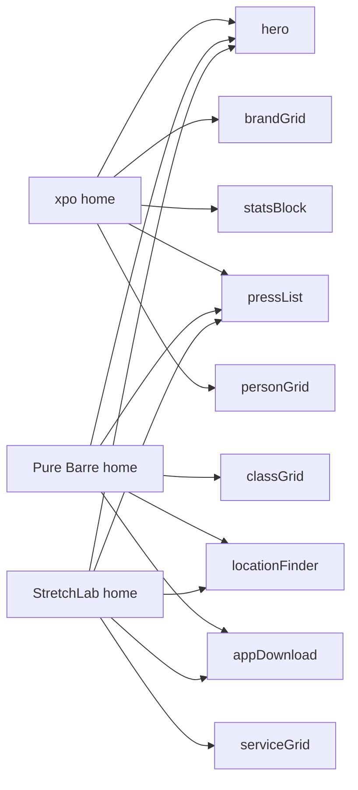

# Home page block renderers

Eight block types are authored on the three home pages but have no renderers, so [apps/web/src/components/pagebuilder.tsx](apps/web/src/components/pagebuilder.tsx) falls through to `UnknownBlockError`. Two layers of work:

## Block coverage




`hero` already renders. `pressList` and `locationFinder` are shared across two sites, so 8 distinct components total cover all three home pages.

## Step 1 — Merge GROQ fragments

Edit [packages/sanity/src/query.ts](packages/sanity/src/query.ts) `pageBuilderFragment` (~line 192). Today it only includes the 7 template selectors. Pull in the 8 we need from [packages/sanity/src/queries-extended.ts](packages/sanity/src/queries-extended.ts):

- `brandGridBlock`, `classGridBlock`, `serviceGridBlock`, `personGridBlock`
- `statsBlockBlock`, `pressListBlock`, `locationFinderBlock`, `appDownloadBlock`

Skip the other 6 (`testimonialCarousel`, `partnerStrip`, `tabbedInfo`, `pageHeader`, `processSteps`, `postGrid`) — not authored anywhere yet.

`pressListBlock` already uses `$siteSlug` in auto mode; `queryHomePageData` already receives `siteSlug` after the routing fix, so no caller change needed.

## Step 2 — Regenerate types

```bash
cd apps/studio && pnpm type
```

Updates `packages/sanity/src/sanity.types.ts`. Each new block type then becomes available via `PagebuilderType<"brandGrid">` etc. (the generic in [apps/web/src/types.ts](apps/web/src/types.ts) is already structured for this — no change needed).

## Step 3 — Build 8 RSC renderers in `apps/web/src/components/sections/`

Each is a server component matching the existing pattern in [hero.tsx](apps/web/src/components/sections/hero.tsx) / [cta.tsx](apps/web/src/components/sections/cta.tsx): typed via `PagebuilderType<T>`, Tailwind layout, `<SanityImage>` for images, `<RichText>` where applicable, `<Link>` for internal nav. Demo-clean polish: readable, responsive grid, no motion.


| File                  | Layout                                                                                                                                                                                                         |
| --------------------- | -------------------------------------------------------------------------------------------------------------------------------------------------------------------------------------------------------------- |
| `brand-grid.tsx`      | Section header + responsive 2/3/4-col grid of cards. Each card = brand cardLogo + name + tagline + optional "Learn more" link to `externalUrl`. Honors `layout: "grid"` (carousel falls back to grid for now). |
| `class-grid.tsx`      | Section header + body + 3-col card grid. Each card = class image + name + duration + intensity badge + shortDescription.                                                                                       |
| `service-grid.tsx`    | Same shape as class-grid, fields: name, image, durationOptions, shortDescription.                                                                                                                              |
| `person-grid.tsx`     | Section header + body + 4-col card grid. Each card = portrait + name + role/title + optional brand pill.                                                                                                       |
| `stats-block.tsx`     | Section header + responsive grid of large `value` + small `label` + tiny `footnote`.                                                                                                                           |
| `press-list.tsx`      | Section header + 3-col card grid. Each card = press hero image + outlet + headline + publishedAt + external link. Cross-site badge ("Featured on N sites") when `isCrossSite`.                                 |
| `location-finder.tsx` | Section header + body + ctaLabel button + responsive grid of featured studio cards (name, city/state, hero image, intro offer, `bookingUrl` button). Search input is intentionally a stub for now.             |
| `app-download.tsx`    | Two-col layout: deviceMockup image on one side, title/body + App Store + Play Store badge buttons on the other.                                                                                                |


Conventions to mirror from existing renderers:

- `import type { PagebuilderType } from "@/types"`
- `<section className="my-6 md:my-16" id="...">` outer wrapper
- `container mx-auto px-4 md:px-6` inner wrapper
- `font-semibold text-3xl md:text-5xl` for section titles
- `text-muted-foreground` for body copy
- `rounded-3xl` corners, no custom colors (theming pass is separate)

## Step 4 — Register in `BLOCK_COMPONENTS`

Add 8 entries to the map in [apps/web/src/components/pagebuilder.tsx](apps/web/src/components/pagebuilder.tsx) line 30:

```ts
const BLOCK_COMPONENTS = {
  // existing 7...
  brandGrid: BrandGrid,
  classGrid: ClassGrid,
  serviceGrid: ServiceGrid,
  personGrid: PersonGrid,
  statsBlock: StatsBlock,
  pressList: PressList,
  locationFinder: LocationFinder,
  appDownload: AppDownload,
} as const satisfies Record<PageBuilderBlockTypes, React.ComponentType<any>>;
```

## Step 5 — Verify

- `cd apps/web && pnpm lint` — clean
- `pnpm check-types` — no new errors
- `curl -sS http://localhost:3000/ | grep -c "Component not found"` → 0
- `curl -sS http://localhost:3000/purebarre | grep -c "Component not found"` → 0
- `curl -sS http://localhost:3000/stretchlab | grep -c "Component not found"` → 0

## Out of scope

- The 6 unused block types (testimonialCarousel, partnerStrip, tabbedInfo, pageHeader, processSteps, postGrid) — easy add later
- Theming (brand colors, fonts) — separate workstream
- LocationFinder search input — stub UI only; real geolocation/search needs a dataset query and probably a client component
- BrandGrid carousel mode — renders as grid for now

